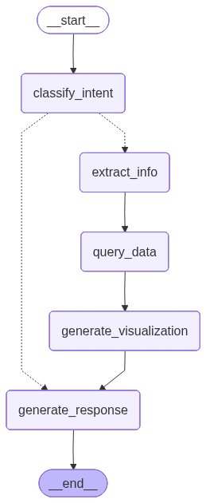

# Real Estate Agent - AI-Powered Property Data Analysis

An intelligent agent that answers complex questions about real estate portfolios using Google's GenAI and RAG (Retrieval Augmented Generation).


https://github.com/user-attachments/assets/385086e8-2e46-415c-9643-d8b2436d27fa


## 🎯 North Star Metric: **90% Accuracy** 
With more time and real user question understanding, we would get to 99% accuracy

This project follows an **eval-first development approach**:
1. ✅ **Evals First** - Started with comprehensive test cases (16 questions across 4 difficulty levels)
2. ✅ **Incremental Development** - Built features iteratively to improve accuracy
3. ✅ **Current Status** - **90% accuracy** on evaluation suite (14.5/16 questions correct)

This methodology ensures quality and prevents regressions as the system evolves.

---

## 🚀 Quick Start

### Installation

1. **Clone and navigate to the project**
```bash
cd real_estate_agent
```

2. **Create virtual environment**
```bash
python -m venv .venv
source .venv/bin/activate  # On Windows: .venv\Scripts\activate
```

3. **Install dependencies**
```bash
pip install -r requirements.txt
```

4. **Configure environment**
```bash
cp .env.example .env
# Edit .env and add your GOOGLE_API_KEY
```

5. **Initialize RAG system**
```bash
python scripts/setup_rag.py
```

6. **Run the application**
```bash
streamlit run app.py
```

The app will open at `http://localhost:8501`

---

## 🏗️ Architecture: Intentionally Simple LangGraph



<details>
<summary>View Mermaid Diagram Source</summary>

The diagram source is available at [`real_estate_agent/docs/graph_diagram.mmd`](real_estate_agent/docs/graph_diagram.mmd) and can be edited at [mermaid.live](https://mermaid.live/).

</details>

### Why Such a Simple Graph?

Our LangGraph workflow is **intentionally minimal** with only 5 nodes:

1. **`classify_intent`** - Determines user intent (PnL analysis, property details, or general chat)
2. **`extract_info`** - Extracts entities (properties, dates, categories) from the query
3. **`query_data`** - Executes structured data queries on the Pandas DataFrame
4. **`generate_visualization`** - Creates chart configurations for data visualization
5. **`generate_response`** - Generates natural language responses

#### Design Philosophy: Simplicity Over Complexity

**We deliberately avoided over-engineering** for several reasons:

1. **Predictable Behavior** 
   - Linear flow is easier to debug and test
   - Each eval failure can be traced to a specific node
   - No complex loops or retry logic that could cause unpredictable behavior

2. **Deterministic Evaluation**
   - With our 90% accuracy target, we need **reproducible results**
   - Simple graphs make it easier to understand why an eval passed or failed
   - Changes in one node have clear, traceable effects

3. **Fast Iteration**
   - Fewer nodes = faster development cycles
   - Quick to add new extraction patterns or query logic
   - Easy to A/B test prompts in specific nodes

4. **Clear Separation of Concerns**
   - Intent classification is isolated from data retrieval
   - Structured queries (DataFrame) are separate from unstructured (RAG)
   - Visualization logic doesn't pollute response generation

5. **Performance**
   - No unnecessary LLM calls in loops
   - Single-pass execution for most queries
   - Conditional routing avoids wasted computation

#### When We'd Add Complexity

We would **only** add more nodes/edges if we needed:
- **Tool calling loops** (e.g., multi-step calculations requiring intermediate results)
- **Human-in-the-loop** (approval gates for sensitive operations)
- **Multi-agent collaboration** (e.g., specialized agents for different property types)
- **Recursive refinement** (iterative query improvement based on data quality)

For a **focused property data analysis agent**, this simple graph hits the sweet spot of capability vs. maintainability.

---

## 📊 Changing the Data

### Option 1: Replace Dataset
Replace the files in the `data/` directory:
- `data/cortex.csv` - Main dataset (CSV format)
- `data/cortex.parquet` - Main dataset (Parquet format, more efficient)

After changing data, re-run:
```bash
python scripts/setup_rag.py
```

### Option 2: Direct Text Input
Paste content directly in the UI text area for quick analysis.

---

## 🧪 Evaluation System

### Pre-built Eval Suite
The project includes **16 ready-to-use evaluation questions** in `data/evals.csv`:
- **Easy** (3 questions) - Basic data retrieval
- **Medium** (3 questions) - Aggregations and filtering
- **Hard** (5 questions) - Complex calculations
- **Very Hard** (5 questions) - Multi-step analytical reasoning

### Run Evaluations

**Full eval pipeline:**
```bash
# 1. Run evals (generates answers)
python scripts/run_evals.py

# 2. Grade the results
python scripts/grade_evals.py

# 3. Generate detailed report
python scripts/generate_eval_report.py
```

Results are saved in `scripts/`:
- `eval_results.json` - Agent responses
- `eval_grades.json` - Grading details
- Grading report displayed in terminal

### Add Your Own Evals

Edit `data/evals.csv` and add rows with:
- `Question_Number` - Unique identifier
- `Difficulty` - Easy, Medium, Hard, Very Hard
- `Question` - The question to ask
- `Answer` - Expected answer
- `Answer_Details` - Additional context for grading

**Example:**
```csv
17,Medium,What is the average rent per unit?,€2500,"Based on 100 units across all properties"
```

Then re-run the eval pipeline to test your new questions.

---
